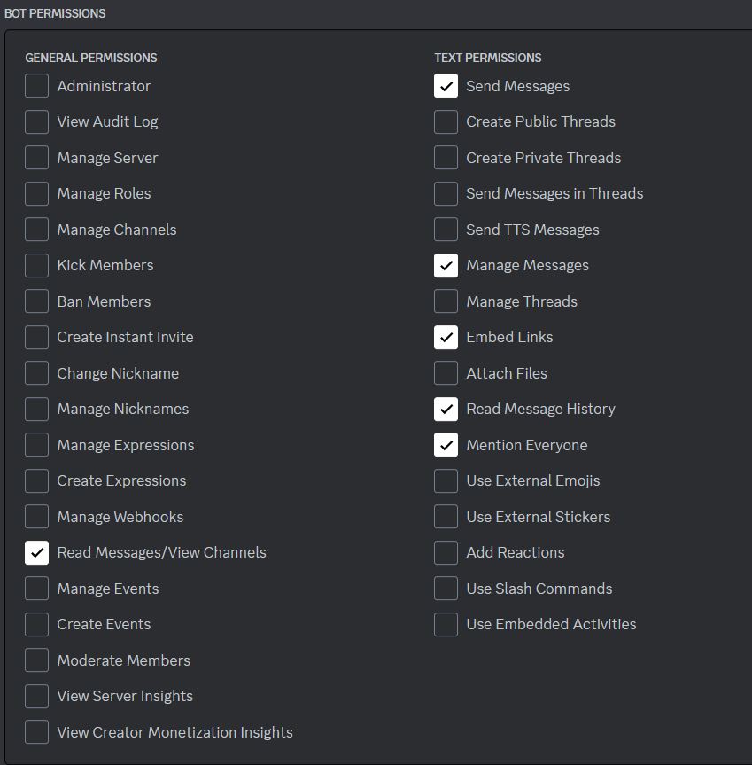
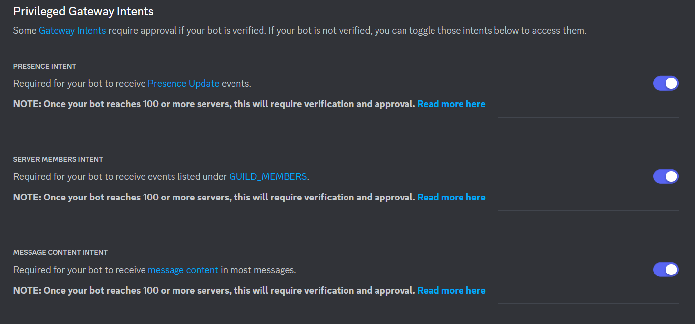

# Discord Text Bot

### Comandos
- **!pk** *(nome ou id)*

Retorna a splash art do pokemon via [PokeApi](https://pokeapi.co/)

- **!dog** 

Retorna uma foto de um cachorro aleátorio via [Dog Api](https://dog.ceo/dog-api/)

- **!kanye**

Retorna uma frase aleatória do cantor Kanye West via [Api Kanye West](https://api.kanye.rest/)

-  **!cep** *(cep da cidade)*

Retorna o nome, estado e cep da cidade via [Brasil Cep Api](https://brasilapi.com.br/docs#tag/CEP)

- **!conta**

Interação marcando o usuário que mandou 

- **!tapa** *(nome)*

Interação entre o usuário que mandou e o usuário marcado

- **!entrou** *(usuário)*

Informa a data que o usuário entrou no servidor


## Configurando o Ambiente virtual
```python
python -m venv .venv
```

**Acessando a pasta**
```python
.venv\Scripts\Activate  
```

**Instalando os requerimentos**
```python
pip install -r requirements.txt
```

**Rodando**
```python
python main.py
```


## Discord

[Site do discord](https://discord.com/developers/applications/)





No arquivo .env ensira o token
```env
TOKEN = seu token aqui
```